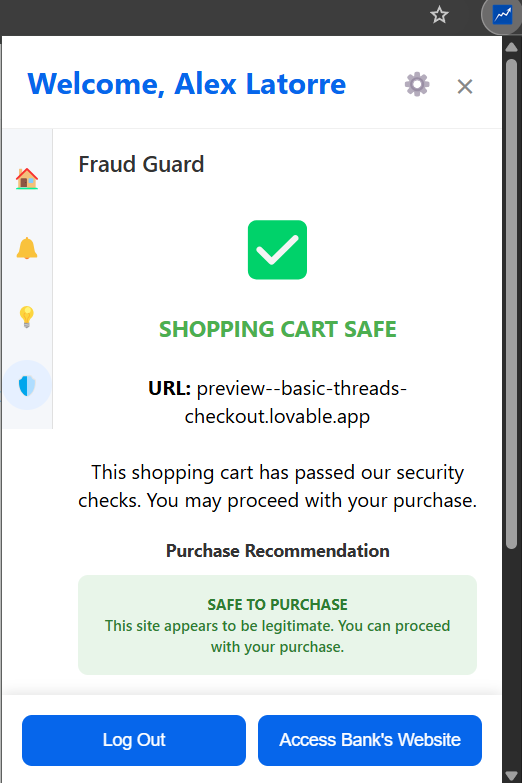

# WiseBuy

Developed for HackUPC 2025

DevPost submission: https://devpost.com/software/wisebuy-hdinj7

Preview YouTube Video: https://youtu.be/ydEnkvGfKkQ

## Overview
WiseBuy is a browser extension that helps users make better financial decisions by analyzing their online shopping behavior. The extension detects when users are on e-commerce checkout pages, analyzes the content for potential fraud, monitors subscription services, and provides insights about purchases in relation to financial goals.

## Features

- **Fraud Detection**: Analyzes URLs and website content to detect potential fraudulent e-commerce sites
- **Shopping Analysis**: Monitors purchases and provides insights about spending habits
- **Subscription Management**: Identifies subscription services and provides reminders to cancel unused subscriptions
- **Financial Goal Tracking**: Shows the impact of purchases on your financial goals
- **Transaction Monitoring**: Real-time monitoring of bank transactions related to online purchases

## Project Structure

```
widgethackupc/
├── startserver.py            # Script to start the backend server
├── widget/                   # Main extension directory
│   ├── api.js                # JavaScript API for the extension
│   ├── background.js         # Extension background script
│   ├── manifest.json         # Extension manifest file
│   ├── widget.py             # Python widget utilities
│   ├── backend/              # Backend server code
│   │   └── app.py            # FastAPI server implementation
│   ├── content/              # Content scripts
│   │   └── content.js        # Script injected into web pages
│   ├── icons/                # Extension icons
│   ├── periocidad/           # Subscription frequency analysis
│   │   └── periocidad.py     # Subscription detection algorithm
│   └── popup/                # Extension popup UI
│       ├── popup.css         # Popup styles
│       ├── popup.html        # Popup HTML structure
│       └── popup.js          # Popup JavaScript functionality
```

## Installation

### Prerequisites
- Python 3.8+
- MongoDB database

### Backend Setup
1. Install required Python packages:
   ```
   pip install fastapi uvicorn pymongo python-dotenv openai requests
   ```

2. Create a `.env` file in the root directory with the following variables:
   ```
   OPENAI_API_KEY=your_openai_api_key
   MONGO_URI=your_mongodb_connection_string
   SECRET_KEY=your_jwt_secret_key
   ```

3. Start the backend server:
   ```
   python startserver.py
   ```
   
   Or directly with uvicorn:
   ```
   uvicorn widget.backend.app:app --reload
   ```

### Browser Extension Setup
1. Open Chrome/Edge and navigate to `chrome://extensions` or `edge://extensions`
2. Enable "Developer mode"
3. Click "Load unpacked" and select the `widget` directory

## Usage

1. **Login**: Sign in to the extension using your registered email and password
2. **Shopping**: Browse e-commerce sites as normal
3. **Automatic Analysis**: When visiting cart/checkout pages, the extension will automatically:
   - Check for potential fraud
   - Analyze your purchase
   - Display notifications about the impact on your financial goals

4. **View Insights**: Click on the extension icon to see:
   - Financial goals progress
   - Recent alerts
   - Subscription recommendations
   - Spending insights

## Development

### Backend API Endpoints

- `/login`: Authenticate users
- `/check-fraud`: Scan URLs for potential fraud
- `/generate-description`: Generate purchase descriptions
- `/get-user-goals`: Retrieve user financial goals
- `/get-username`: Get the current user's name
- `/get-user-subscriptions`: Get user's current subscriptions
- `/stream-transactions`: Real-time transaction monitoring

### Adding New Features

To extend the extension with new features:

1. Backend: Add new endpoints to `app.py`
2. Content Script: Update `content.js` to capture relevant page data
3. Popup UI: Modify `popup.html` and `popup.js` to display new information

## Screenshots and Examples
### Login


### Dashboard View

*The main dashboard shows your financial goals progress and recent activity*

### Fraud Detection

*The extension alerts you when a potentially fraudulent website is detected*


*The extension alerts you when a potentially fraudulent website is detected*

### Subscription Management

*See all your active subscriptions and get recommendations for unused services*

### Example Use Cases

#### Scenario 1: Preventing Fraud
When shopping on an unfamiliar website, the extension analyzes the URL and content to determine if it's potentially fraudulent. If suspicious activity is detected, a warning popup appears:

```
🚨 Warning: This website shows signs of potential fraud!
- Domain registered recently (2 days ago)
- No secure payment methods detected
- Similar to known phishing sites
```

#### Scenario 2: Budget Impact
When adding items to your cart, the extension provides real-time feedback on how this purchase affects your financial goals:

```
💰 Financial Impact Analysis:
- This purchase would delay your "Summer Vacation" goal by 12 days
- You've already spent 85% of your monthly shopping budget
```

#### Scenario 3: Subscription Optimization
The extension detects your recurring payments and provides insights:

```
## License

This project is licensed under the MIT License - see the LICENSE file for details.

## Acknowledgments

- Built during HackUPC, the student hackathon at Universitat Politècnica de Catalunya
- Uses OpenAI's API for content analysis
- Uses VirusTotal API for fraud detection
